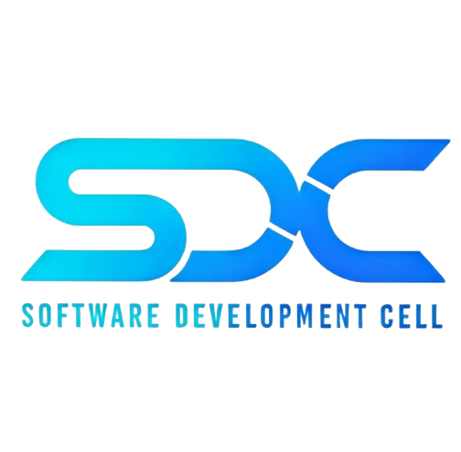
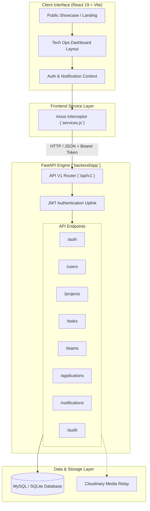

<div align="center">

  

  # ❄️ SDC PORTAL — GLACIAL FORGE V6
  ### *Tactical Command Center & LMS for Skill Development Cell*

  [](https://fastapi.tiangolo.com/)
  [](https://react.dev/)
  [](https://vitejs.dev/)
  [](https://tailwindcss.com/)
  [](https://www.python.org/)
  [](#license)
  [](#)

  <p align="center">
    <b>A high-performance, cinematic developer management system and showcase portal.</b><br>
    Bridging high-impact visitor experiences with tactical LMS operations, real-time developer telemetry, team formation, and project lifecycles.
  </p>

  ---

</div>

## 📌 Table of Contents

- [🌌 Vision & Design Philosophy](#-vision--design-philosophy)
- [✨ Key Features](#-key-features)
- [🛠️ Tech Stack](#️-tech-stack)
- [🏗️ System Architecture](#️-system-architecture)
- [📁 Project Structure](#-project-structure)
- [🚀 Quick Start & Installation](#-quick-start--installation)
  - [Prerequisites](#prerequisites)
  - [1. Backend Setup](#1-backend-setup)
  - [2. Frontend Setup](#2-frontend-setup)
  - [3. One-Click Launch (Windows)](#3-one-click-launch-windows)
- [📡 API Reference](#-api-reference)
- [🎨 Design System & Color Tokens](#-design-system--color-tokens)
- [🔒 Security & Environment Variables](#-security--environment-variables)
- [🤝 Contributing](#-contributing)
- [📜 License](#-license)

---

## 🌌 Vision & Design Philosophy

The **SDC Portal** transitions seamlessly from an immersive, crystal-white glassmorphic public showcase into an ultra-sleek, dark-themed **Tech Ops Command Center**. Built for student developers, mentors, and administrators of the Skill Development Cell, the portal prioritizes:

- **Command Center Mindset**: Information rendered like live telemetry with high data density, monospaced tracking, and intentional actions.
- **Cinematic Aesthetics**: High-end visual experience powered by smooth motion dynamics, dynamic lighting accents, and glassmorphism.
- **Modular Atomic Architecture**: Clean separation between reusable common components, layouts, and domain-specific feature views.

---

## ✨ Key Features

### 🛡️ Role-Based Access Control (RBAC)
- Multi-tier user roles: **Student / Member**, **Team Lead / Mentor**, and **Administrator**.
- JWT-authenticated secure uplink with persistent state hydration and context security.

### 🚀 Project & Sprint Lifecycle Management
- Track projects across all operational phases (`IDEATION`, `IN_PROGRESS`, `REVIEW`, `COMPLETED`).
- Project member allocation, tech stack tags, repository integration links, and progress meters.

### ⚡ Sprint & Kanban Task Engine
- Granular task pipelines with status flow (`TODO`, `IN_PROGRESS`, `REVIEW`, `DONE`).
- Priority assignments, due date tracking, mentor review workflows, and task completion metrics.

### 🏆 Developer Telemetry & Leaderboards
- Gamified experience points (XP), contribution scores, and operational badges.
- Real-time leaderboard showcasing top-performing developers and active squads.

### 📥 Student Recruitment & Onboarding Pipeline
- Integrated recruitment pipeline allowing students to apply for SDC domain teams.
- Application status review (Pending, Shortlisted, Interviewing, Approved, Rejected) with administrative decision feeds.

### 📢 Command Broadcasts & Notification Relay
- Real-time in-app notification center for system events, task assignments, and review approvals.
- High-priority notice announcements for broad broadcasts across the cell.

### 📜 Security Audit & Operational Logs
- Immutable audit trail capturing user authentication events, entity modifications, and system configuration updates.

---

## 🛠️ Tech Stack

### Frontend (`/frontend`)
| Technology | Version | Purpose |
| :--- | :--- | :--- |
| **React** | v19.2 | Declarative UI framework |
| **Vite** | v8.1 | Next-generation frontend build tooling |
| **TailwindCSS** | v4.3 | Utility-first responsive design tokens |
| **Framer Motion** | v12.4 | Fluid micro-animations & layout transitions |
| **Lucide React** | v1.23 | Modern vector iconography |
| **React Router** | v7.18 | Client-side routing with nested layouts |
| **Axios** | v1.18 | HTTP service layer with request/response interceptors |

### Backend (`/backend`)
| Technology | Version | Purpose |
| :--- | :--- | :--- |
| **Python** | 3.12+ / 3.14 | Core execution environment |
| **FastAPI** | 0.110+ | High-performance asynchronous REST API framework |
| **SQLModel / SQLAlchemy** | 0.0.16+ | ORM data mapping & schema validation |
| **MySQL / SQLite** | 3NF | Relational database storage |
| **PyJWT & Passlib** | 2.8+ / 1.7+ | Token generation, hashing, & authentication |
| **Cloudinary** (Optional) | 1.40+ | Cloud media management for user uploads |

---

## 🏗️ System Architecture



---

## 📁 Project Structure

```text
SDC_Portal/
├── assets/                       # Global branding assets (logos, media)
│   └── sdc_logo.png
├── backend/                      # FastAPI Backend Engine (ForgeCore)
│   ├── app/
│   │   ├── api/                  # API routes & v1 endpoint routers
│   │   │   ├── deps.py           # Dependency injection & Auth guards
│   │   │   └── v1/
│   │   │       └── endpoints/    # Auth, Users, Teams, Projects, Tasks, etc.
│   │   ├── core/                 # App configuration & security settings
│   │   ├── db/                   # Database session init & engine binding
│   │   ├── models/               # SQLModel schemas & entity definitions
│   │   └── main.py               # FastAPI application entrypoint
│   ├── requirements.txt          # Python dependencies
│   └── sdc_portal.db             # Local database instance
├── frontend/                     # React 19 + Vite Frontend (GlacialForge)
│   ├── src/
│   │   ├── api/                  # API client & HTTP service abstractions
│   │   ├── components/           # Atomic component library (common, layout, landing)
│   │   ├── context/              # React Context (AuthContext)
│   │   ├── layouts/              # Dashboard & Root structural layouts
│   │   ├── pages/                # Page views (Dashboard, Projects, Tasks, Teams, etc.)
│   │   ├── App.jsx               # Main React router & provider tree
│   │   └── index.css             # TailwindCSS v4 design tokens & base styles
│   ├── package.json              # NPM dependencies & scripts
│   └── vite.config.js            # Vite bundler configuration
├── DESIGN_GUIDELINES.md          # Architectural & design guidelines handbook
├── start.bat                     # One-click Windows dev environment launcher
└── README.md                     # Project documentation
```

---

## 🚀 Quick Start & Installation

### Prerequisites
Make sure you have the following installed on your development machine:
- **Node.js**: `v18.0.0` or higher
- **npm**: `v9.0.0` or higher
- **Python**: `v3.10` or higher
- **Git**

---

### 1. Backend Setup

1. **Navigate to the backend directory:**
   ```bash
   cd backend
   ```

2. **Create and activate a virtual environment:**
   - **Windows (PowerShell / CMD):**
     ```powershell
     python -m venv venv
     .\venv\Scripts\activate
     ```
   - **Linux / macOS:**
     ```bash
     python3 -m venv venv
     source venv/bin/activate
     ```

3. **Install backend dependencies:**
   ```bash
   pip install -r requirements.txt
   ```

4. **Configure Environment Variables:**
   Create a `.env` file inside the `backend` directory (optional, defaults are provided in `app/core/config.py`):
   ```env
   SECRET_KEY=your_super_secret_jwt_key
   DATABASE_URL=sqlite:///./sdc_portal.db
   ALLOWED_ORIGINS=http://localhost:5173,http://127.0.0.1:5173
   ```

5. **Start the FastAPI Development Server:**
   ```bash
   uvicorn app.main:app --reload --host 127.0.0.1 --port 8000
   ```
   *The backend API will be live at `http://127.0.0.1:8000` with Swagger docs at `http://127.0.0.1:8000/sdc_portal/docs`.*

---

### 2. Frontend Setup

1. **Open a new terminal and navigate to the frontend directory:**
   ```bash
   cd frontend
   ```

2. **Install frontend dependencies:**
   ```bash
   npm install
   ```

3. **Start the Vite Development Server:**
   ```bash
   npm run dev
   ```
   *The frontend portal will be accessible at `http://localhost:5173`.*

---

### 3. One-Click Launch (Windows)

For rapid development on Windows systems, execute the provided batch script in the project root:

```cmd
start.bat
```

This script automatically launches both the FastAPI backend server (Port `8000`) and the Vite React frontend server (Port `5173`) in concurrent terminal windows.

---

## 📡 API Reference

Interactive API documentation with request schemas and live testing endpoints is automatically served by FastAPI:

- 📖 **Interactive Swagger UI**: [`http://localhost:8000/sdc_portal/docs`](http://localhost:8000/sdc_portal/docs)
- 📄 **OpenAPI Specification**: [`http://localhost:8000/sdc_portal/openapi.json`](http://localhost:8000/sdc_portal/openapi.json)

### Core Endpoint Modules

| Endpoint Group | Prefix | Description | Auth Required |
| :--- | :--- | :--- | :---: |
| **Authentication** | `/api/v1/auth` | User login, JWT token dispatch, current user profile | 🔓 / 🔒 |
| **Users** | `/api/v1/users` | User management, profile updates, role assignment | 🔒 |
| **Teams** | `/api/v1/teams` | Domain teams creation, member assignments | 🔒 |
| **Projects** | `/api/v1/projects` | Project lifecycle CRUD, repository & status updates | 🔒 |
| **Tasks** | `/api/v1/tasks` | Task pipeline creation, updates, and reviewer sign-offs | 🔒 |
| **Applications** | `/api/v1/applications` | Recruitment pipeline submission & administrative review | 🔒 |
| **Notifications** | `/api/v1/notifications`| User alerts, read status toggles, unread counts | 🔒 |
| **Audit Logs** | `/api/v1/audit` | System audit trail logs and action tracking | 🔒 (Admin) |

---

## 🎨 Design System & Color Tokens

The frontend uses a custom color palette configured via TailwindCSS v4:

| Token Name | Visual | Hex Value | Usage |
| :--- | :---: | :--- | :--- |
| **Midnight Base** |  | `#020617` | Main canvas background & core containers |
| **Dark Slate** |  | `#1c222b` | Card surfaces, modal containers, table rows |
| **Cyan Accent** |  | `#00b4d8` | **Primary Brand Color** — Glowing accents & active states |
| **Electric Blue** |  | `#3b82f6` | Action buttons, highlight meters & badges |
| **Muted White** |  | `#94a3b8` | Secondary typography & monospaced label tracking |

For full design patterns, micro-animation guidelines, and component rules, refer to [DESIGN_GUIDELINES.md](file:///a:/New%20project/SDC_Portal/DESIGN_GUIDELINES.md).

---

## 🔒 Security & Environment Variables

Key security configurations enforced in production:
- **JWT Secret**: Always generate a unique 256-bit secret key for production environments.
- **CORS Protection**: Limit `ALLOWED_ORIGINS` to trusted frontend domains in deployment.
- **Password Hashing**: Cryptographic password protection using `bcrypt` / `passlib`.

---

## 🤝 Contributing

We welcome contributions from SDC members and developer recruits!

1. **Fork or create a feature branch** off `main`:
   ```bash
   git checkout -b feature/your-feature-name
   ```
2. **Follow Code Conventions**:
   - Ensure components follow the Tech Ops Command Center aesthetic.
   - Run `npm run lint` inside `/frontend` to verify code quality.
3. **Commit & Push**:
   ```bash
   git commit -m "feat: Add new command center module"
   git push origin feature/your-feature-name
   ```
4. **Open a Pull Request** targeting the `main` branch.

---

## 📜 License

This project is proprietary and maintained by the **Skill Development Cell (SDC)** team.

<div align="center">
  <sub>Engineered with precision for the future of developer management.</sub>
</div>
